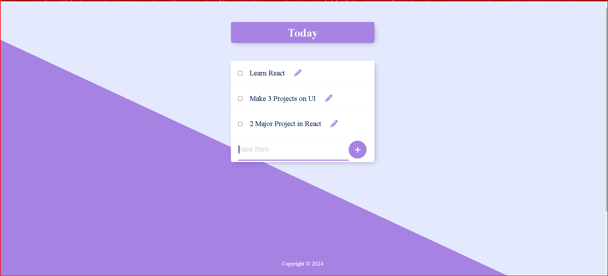

# PermaList

A persistent todo list application built with Express.js, PostgreSQL, and EJS templating.



## Features

- Create, read, update, and delete todo items
- Persistent storage using PostgreSQL
- Clean, minimal interface
- Real-time updates

## Tech Stack

- Node.js/Express.js
- PostgreSQL
- EJS templating
- Body Parser
- dotenv for configuration

## Prerequisites

- Node.js
- PostgreSQL
- npm

## Installation

1. Clone the repository:
```bash
git clone https://github.com/yourusername/permalist.git
cd permalist
```

2. Install dependencies:
```bash
npm install
```

3. Set up your environment variables in `.env`:
```
user=your_db_user
host=your_db_host
database=your_db_name
password=your_db_password
port=your_db_port
```

4. Set up the database:
```sql
CREATE TABLE items (
  id SERIAL PRIMARY KEY,
  title VARCHAR(100) NOT NULL
);

INSERT INTO items (title) VALUES ('Buy milk'), ('Finish homework');
```

5. Start the server:
```bash
node server.js
```

The application will be available at `http://localhost:3000`

## API Endpoints

- `GET /` - Display all todo items
- `POST /add` - Add a new item
- `POST /edit` - Update an existing item
- `POST /delete` - Delete an item

## Contributing

Pull requests are welcome. For major changes, please open an issue first to discuss what you would like to change.


